# VCM-Lite Edge Camera: Task-Aware Semantic Video Compression on Arduino Uno Q

VCM-Lite is a real-time-capable semantic edge-camera pipeline for traffic-video monitoring. It streams video over WebRTC into an Arduino Uno Q, applies lightweight ISP enhancement, detects vehicle regions, compresses the scene as a low-resolution context frame plus high-value object ROI tiles, reconstructs a semantic frame, and validates whether task-relevant vehicle evidence is preserved after compression.

The project is inspired by the direction of **Video Coding for Machines (VCM)**: instead of optimizing video only for human viewing, the camera should preserve information that downstream machine-vision tasks need. This implementation is called **VCM-Lite** because it is not a full MPEG-VCM codec. It is a practical edge prototype that demonstrates the same idea using lightweight components that can run on constrained hardware.

```text
Traffic video source
        ↓
WebRTC live ingest
        ↓
Arduino Uno Q Linux side
        ↓
ISP-Lite enhancement
        ↓
Fine-tuned vehicle detector + motion ROI
        ↓
Semantic context + ROI compression
        ↓
Semantic reconstruction
        ↓
Task validation
        ↓
Closed-loop adaptive controller
        ↓
FastAPI dashboard + logs + MCU telemetry
```

---

## Why this project matters

Traditional video compression tries to preserve pixels for human viewing. Edge AI cameras often need something different: they need to preserve enough information for a downstream task such as vehicle detection, event monitoring, or traffic analytics while reducing bandwidth and compute cost.

A fixed roadside camera can observe:

```text
empty road
occasional cars
dense traffic
night/low-light scenes
streetlight glare
headlight glare
network limits
device compute limits
```

A normal camera pipeline may send full frames at a fixed quality regardless of scene importance. That wastes bandwidth on background regions and can overload the edge device during dense traffic.

VCM-Lite treats video as a **task-aware signal**:

```text
background/context regions:
    keep lower-resolution scene context

vehicle/object regions:
    preserve higher-quality ROI evidence

controller:
    adapt ROI count, ROI quality, context quality, detector interval, and re-encoding based on runtime conditions
```

The goal is not only to make the reconstructed frame visually acceptable. The goal is to preserve the evidence needed by the downstream detector while staying within edge latency and bitrate limits.

---

## What “real-time-capable” means here

The current evaluation uses **file-based video streaming into a live WebRTC ingest path**.

The videos are stored in a folder, but they are not directly read by the C++ engine as offline files during the final system test. Instead, the laptop sender reads video frames and sends them over WebRTC to the Arduino Uno Q signaling/receiver stack. This simulates the role of a live traffic camera or network camera.

```text
MP4 demo video
        ↓
dataset_sender.py
        ↓
WebRTC offer/answer signaling
        ↓
Uno Q WebRTC receiver
        ↓
raw BGR socket bridge
        ↓
C++ semantic edge engine
```

So the current system should be understood as:

```text
real-time-capable edge pipeline
WebRTC-based live ingest path
folder/video-file sender used as repeatable camera source
not a production physical camera integration yet
```

A physical camera integration would replace the MP4 sender with a camera capture source, while keeping the same WebRTC ingest, C++ processing engine, dashboard, and telemetry structure.

---

## Why WebRTC is used

WebRTC is used because it is directly relevant to real-world low-latency video systems. Many production video products, telepresence systems, camera systems, browser-based monitoring tools, robotics interfaces, and remote sensing systems use WebRTC or WebRTC-like streaming paths.

For this project, WebRTC gives the prototype a more realistic system boundary than simply reading frames from a file inside OpenCV.

WebRTC adds:

```text
live stream semantics
offer/answer signaling
networked frame delivery
real-time sender/receiver separation
a production-style ingest interface
```

The C++ engine does not directly read the video file in the final pipeline. It receives frames after the WebRTC receiver decodes them and forwards raw BGR frames locally.

This better represents a deployed edge camera where video arrives continuously from a live source.

---

## Why it is called VCM-Lite

VCM-Lite is inspired by **Video Coding for Machines**, where the goal is to encode video in a way that preserves machine-task performance rather than only human visual quality.

This project is “Lite” because it does not implement a full standard video codec or a complete MPEG-VCM reference pipeline. Instead, it builds a compact, explainable, edge-deployable semantic codec:

```text
low-resolution context JPEG
+ packed object ROI tile JPEG
+ ROI metadata
+ reconstruction logic
+ task validation
+ adaptive control
```

The project demonstrates the central VCM idea:

```text
send fewer pixels where the machine does not care
preserve stronger evidence where the task does care
measure success with both visual reconstruction metrics and task-preservation metrics
```

---

## Main contribution: adaptive semantic edge control

The main contribution of VCM-Lite is not only detecting vehicles or compressing ROI tiles. The key contribution is the **closed-loop adaptive semantic control loop**.

A fixed semantic encoder can fail in two ways:

```text
too conservative:
    keeps too much background or too many ROIs
    increases bitrate and latency

too aggressive:
    removes important object evidence
    hurts downstream detection
```

VCM-Lite continuously measures runtime and task-quality signals, then changes the semantic packet structure while the stream is running.

```text
measure runtime + task quality
        ↓
adapt semantic packet structure
        ↓
preserve object evidence
        ↓
control bitrate and latency
```

This makes the project closer to a deployable edge-camera system than a static compression demo.

---

## Adaptability beyond traffic cameras

This project uses a vehicle detector because traffic-camera monitoring is a clear and realistic use case. The detector was built from a pretrained YOLO model and fine-tuned for traffic objects such as cars, vans, and buses. However, the architecture is not limited to traffic.

The same pipeline can be transferred to other edge-camera tasks by changing the detector and ROI policy:

```text
factory defect monitoring:
    preserve product/defect ROIs

retail shelf monitoring:
    preserve product/person ROIs

warehouse robotics:
    preserve pallet/forklift/human ROIs

security cameras:
    preserve person/vehicle/event ROIs

wildlife monitoring:
    preserve animal ROIs

smart city sensing:
    preserve pedestrian, vehicle, or signal-light ROIs
```

The reusable idea is:

```text
task model defines what matters
ROI selector preserves task evidence
semantic encoder compresses background more aggressively
reconstruction validator checks whether task evidence survived
controller adapts quality and compute based on runtime pressure
```

So VCM-Lite is best viewed as a **task-aware semantic edge-camera architecture**, with traffic monitoring used as the final implemented case study.

---

## Core problem

A traffic camera running on an edge device has limited compute and bandwidth. During dense scenes, many vehicles can appear at once. During night scenes, low-light and glare can make detection more difficult. A good edge camera should adapt to these conditions.

The key question is:

```text
Can an edge camera preserve vehicle-detection evidence while reducing semantic payload size and controlling latency?
```

VCM-Lite answers this by combining:

```text
1. WebRTC live ingest
2. ISP-lite preprocessing
3. fine-tuned vehicle detection
4. motion ROI fallback
5. semantic context + object ROI compression
6. semantic reconstruction
7. task-preservation validation
8. closed-loop adaptive controller
9. dashboard observability
10. MCU health telemetry
```

---

## System overview

```text
+--------------------------------+
| Video sender                    |
| dataset_sender.py               |
| MP4 folder acts as camera feed  |
+--------------------------------+
                |
                | WebRTC
                v
+--------------------------------+
| Uno Q WebRTC receiver           |
| receiver.py                     |
| decodes frames to BGR           |
+--------------------------------+
                |
                | local raw BGR TCP socket
                v
+--------------------------------+
| C++ semantic engine             |
| ISP + ROI + semantic encoding   |
+--------------------------------+
                |
                v
+--------------------------------+
| Semantic reconstruction          |
| context + ROI tile              |
+--------------------------------+
                |
                v
+--------------------------------+
| Task validation                  |
| detector confidence before/after|
+--------------------------------+
                |
                v
+--------------------------------+
| Adaptive controller              |
| quality, ROI, detector interval |
+--------------------------------+
                |
                v
+--------------------------------+
| FastAPI dashboard + logs         |
| metrics, images, controller     |
+--------------------------------+
                |
                v
+--------------------------------+
| Internal MCU telemetry           |
| compact health/status reporting |
+--------------------------------+
```

---

## Main features

VCM-Lite implements the following components:

```text
WebRTC live ingest
raw BGR local frame bridge into C++ engine
ISP-lite image tuning
fine-tuned YOLOv8n vehicle detector exported to ONNX
motion ROI fallback
target-filtered vehicle ROI selection
semantic context + ROI tile compression
semantic reconstruction
PSNR and SSIM reconstruction metrics
task preservation loss
closed-loop adaptive ROI/bitrate/latency controller using task loss, ROI area, queue pressure, and semantic bitrate
FastAPI dashboard
JSONL benchmarking logs
internal MCU telemetry status loop
```

---

## ISP-Lite enhancement

Before ROI selection and semantic compression, each frame passes through an ISP-lite stage.

The ISP-lite stage estimates:

```text
input brightness
input contrast
sharpness
noise level
```

Then it applies a lightweight combination of:

```text
brightness gain
gamma correction
contrast adjustment
denoising
sharpening
CLAHE when useful
```

The goal is not only to make the frame visually nicer. The goal is to improve the quality of evidence available to the detector before ROI selection.

For example, in the final benchmark:

```text
dense traffic:
input brightness  = 79.43
output brightness = 109.74
input contrast    = 43.27
output contrast   = 59.21
```

This means the pipeline strengthens the frame before semantic compression and task validation.

---

## Vehicle detector

The project uses a YOLOv8n-style detector. The workflow starts from a pretrained YOLO model and fine-tunes it for the traffic-camera domain. The final ONNX model is used inside the edge pipeline.

The detector is used for:

```text
vehicle ROI selection
object-event snapshots
reference confidence measurement
reconstructed confidence measurement
task-preservation loss
```

The final label set is:

```text
car
van
bus
others
```

The model files are placed under:

```text
models/object_detector.onnx
models/labels.txt
```

The trained ONNX model is stored with Git LFS because ONNX model files can be large.

---

## Semantic compression idea

VCM-Lite does not send the full frame at uniform quality.

Instead, each frame is represented as:

```text
1. low-resolution context frame
2. packed object ROI tile
3. ROI metadata
4. quality/controller metadata
```

The context frame keeps the global scene structure. The ROI tile keeps vehicle/object evidence at higher detail.

```text
Original frame
        ↓
low-resolution context
        +
object ROI crops packed into a tile
        ↓
semantic packet
        ↓
semantic reconstruction
```

This gives a compact representation that preserves task-relevant areas better than sending every region equally.

---

## Semantic reconstruction

The reconstruction process decodes:

```text
context JPEG
ROI tile JPEG
ROI metadata
```

Then it places object ROI patches back into the upscaled context frame.

The reconstructed frame is not meant to be identical to the original. It is meant to preserve enough task evidence for vehicle detection and monitoring.

This is visible in the dashboard screenshots: background regions are heavily simplified, but important vehicle ROIs are preserved and remain detectable. In the night example, the reconstruction ignores less important overlay text and timestamp-like visual details because they are not useful for the vehicle-detection task. The project is intentionally task-aware rather than pixel-perfect.

VCM-Lite evaluates reconstruction using:

```text
PSNR
SSIM
reference detector confidence
reconstructed detector confidence
detection confidence drop
task preservation loss
```

---

## Task preservation loss

Pixel metrics alone do not tell the full story. A reconstructed frame can look visually different but still preserve the important vehicle evidence.

VCM-Lite therefore measures task preservation using detector confidence before and after reconstruction.

```text
reference confidence      = detector confidence on ISP-tuned frame
reconstructed confidence  = detector confidence on reconstructed semantic frame
confidence drop           = reference - reconstructed
task preservation loss    = combined ROI distortion + confidence drop signal
```

Lower task preservation loss is better.

The dense traffic run achieved:

```text
task preservation loss = 0.0247
SSIM                   = 0.9748
PSNR                   = 24.82 dB
```

This is the strongest result because dense traffic is the main target case for the adaptive semantic controller.

---

## Adaptive controller

The adaptive controller is one of the main contributions of VCM-Lite. The project is not only a fixed ROI encoder; it actively changes its behavior based on scene complexity, runtime pressure, and task-preservation quality.

A fixed semantic encoder can fail in two ways:

```text
too conservative:
    keeps too much background or too many ROIs
    increases bitrate and latency

too aggressive:
    removes important object evidence
    hurts downstream detection
```

VCM-Lite addresses this using a runtime controller that observes:

```text
estimated FPS
latency
queue depth
dropped frames
ROI area ratio
semantic bitrate
task preservation loss
detector confidence drop
```

Based on these signals, the controller changes:

```text
object ROI quality
background/context quality
context size
ROI tile size
maximum number of ROIs
detector interval
whether semantic re-encoding is allowed
```

The controller states include:

```text
sparse_idle
balanced
realtime_protect
dense_roi
dense_extreme
overload_low_fps
```

The most important state for the final results is:

```text
dense_roi
```

This state appears when the scene has large vehicle ROI area or high semantic packet bitrate. In this state, the system prioritizes vehicle ROIs, reduces context cost, caps semantic packet growth, and avoids wasting bandwidth on less important background regions.

This adaptive behavior is why the dense traffic scenario became the strongest result. Dense traffic had the highest ROI area ratio, but the controller mostly selected `dense_roi` and still achieved:

```text
average latency          = 138.92 ms
P95 latency              = 316.09 ms
semantic bitrate         = 693.89 kbps
task preservation loss   = 0.0247
semantic SSIM            = 0.9748
```

So the contribution is not only detecting vehicles or compressing ROI tiles. The key contribution is the closed-loop behavior:

```text
measure runtime + task quality
        ↓
adapt semantic packet structure
        ↓
preserve object evidence
        ↓
control bitrate and latency
```

This makes VCM-Lite closer to a deployable edge-camera system than a static compression demo.

---

## Internal MCU telemetry

The Arduino Uno Q has a Linux-capable application side and an internal MCU side. VCM-Lite uses the Linux side for the WebRTC receiver, C++ engine, dashboard, and logging.

The internal MCU is used as a lightweight telemetry/status companion. It reads compact health information from the edge pipeline and reports health states such as:

```text
GREEN / YELLOW / RED style health
FPS
latency
bitrate
task loss
controller state
```

This demonstrates a realistic split:

```text
Linux side:
    heavy video processing, WebRTC, C++ engine, dashboard

MCU side:
    compact device health/status loop
```

This matters because real embedded systems often separate high-level compute from low-level monitoring and safety/status logic.

---

## Evaluation videos

The final evaluation uses three traffic-camera scenarios.

```text
assets/videos/demo/detrac_sparse_1_2_cars.mp4
assets/videos/demo/videoplayback.mp4
assets/videos/demo/457701_Asia_Korea_3840x2160.mp4
```

They correspond to:

```text
sparse/object-light traffic
short low-light night stress clip
dense traffic
```

The dense video is a high-resolution traffic clip and is resized by the sender for the edge pipeline.

The night video is intentionally described as a **short low-light stress clip**. Because it is short, startup effects and per-validation costs have more influence on average latency and FPS. It is still useful because it stresses the detector under low-light and glare-like conditions.

---

## Evaluation setup

The final runs were executed with the following structure:

```text
Sender side:
    dataset_sender.py streams video over WebRTC

Arduino Uno Q:
    signaling server
    WebRTC receiver
    C++ semantic engine
    FastAPI dashboard
    MCU telemetry
```

The sender uses a repeatable file-based camera source:

```powershell
cd sensor_sender
.\.venv\Scripts\activate

python dataset_sender.py --video "../assets/videos/demo/<video>.mp4" --signaling-url "http://<uno-q-ip>:9000" --resize-width 640 --max-fps 15 --reset
```

> Replace `<uno-q-ip>` with the IP address of the Arduino Uno Q on the local network. Commands are shown relative to the repository root and do not require hard-coded local user paths.

The pipeline logs metrics to:

```text
logs/metrics.jsonl
logs/metadata.jsonl
outputs/detection_history.jsonl
outputs/validation_history.jsonl
```

The final benchmark artifacts are stored under:

```text
benchmarks/final_runs/
benchmarks/final_results/
```

---

## End-to-end results

### Final comparison table

| Scenario            | Frames | Avg FPS | Avg Latency | P95 Latency | Avg Bitrate | Task Loss |     PSNR |   SSIM | ROI Area |
| ------------------- | -----: | ------: | ----------: | ----------: | ----------: | --------: | -------: | -----: | -------: |
| Sparse/object-light |    208 |   10.07 |   217.06 ms |   415.67 ms | 741.21 kbps |    0.0311 | 22.96 dB | 0.9337 |   0.2106 |
| Night stress        |     32 |    2.10 |   678.02 ms |  1030.73 ms | 109.56 kbps |    0.1766 | 20.72 dB | 0.9448 |   0.0646 |
| Dense traffic       |    363 |    6.43 |   138.92 ms |   316.09 ms | 693.89 kbps |    0.0247 | 24.82 dB | 0.9748 |   0.2489 |

A key result is that dense traffic does not simply overload the pipeline. The adaptive controller recognizes the large ROI area and moves into `dense_roi`, where it caps semantic packet growth while preserving vehicle evidence. This is why the dense run achieves the lowest task preservation loss even though it has the highest ROI area ratio.

The dense traffic scenario is the main target case. Even with the highest ROI area ratio, the controller maintained the best task preservation loss and the lowest average latency among the three scenarios.

```text
dense traffic:
average latency          = 138.92 ms
P95 latency              = 316.09 ms
average bitrate          = 693.89 kbps
task preservation loss   = 0.0247
semantic PSNR            = 24.82 dB
semantic SSIM            = 0.9748
```

---

## ISP-Lite numeric results

| Scenario            | Input Brightness | Output Brightness | Input Contrast | Output Contrast | Brightness Gain | Gamma | CLAHE Ratio | Avg ISP Time |
| ------------------- | ---------------: | ----------------: | -------------: | --------------: | --------------: | ----: | ----------: | -----------: |
| Sparse/object-light |           110.99 |            110.81 |          53.56 |           57.80 |            0.95 |  0.96 |       0.034 |     49.36 ms |
| Night stress        |            90.02 |            110.59 |          51.96 |           68.70 |            1.17 |  1.00 |       0.000 |     51.21 ms |
| Dense traffic       |            79.43 |            109.74 |          43.27 |           59.21 |            1.33 |  0.93 |       0.303 |     58.17 ms |

The ISP stage improves frame statistics before ROI selection and semantic encoding. The night and dense clips show clear brightness and contrast improvement before the detector sees the frame.

---

## Runtime breakdown

### Dense traffic

```text
queue_wait_ms              avg 38.77   p95 174.26  max 506.89
processing_ms              avg 100.14  p95 138.36  max 732.11
isp_ms                     avg 58.17   p95 76.11   max 633.80
motion_roi_ms              avg 7.76    p95 9.61    max 15.69
detector_ms                avg 8.93    p95 0.00    max 376.96
semantic_encode_ms         avg 11.25   p95 13.48   max 44.68
semantic_reconstruct_ms    avg 0.24    p95 0.00    max 7.67
compressed_validation_ms   avg 3.48    p95 0.00    max 265.06
event_write_ms             avg 0.18    p95 0.00    max 33.27
```

Dense traffic is the best overall system result. The detector does not run every frame; it is scheduled and reused, which is why average detector time is low while max detector time reflects the actual DNN execution frames.

### Sparse/object-light traffic

```text
queue_wait_ms              avg 129.86  p95 216.58  max 521.83
processing_ms              avg 87.19   p95 111.25  max 827.40
isp_ms                     avg 49.36   p95 54.99   max 621.17
motion_roi_ms              avg 8.00    p95 10.59   max 16.28
detector_ms                avg 10.86   p95 0.00    max 356.42
semantic_encode_ms         avg 7.15    p95 11.74   max 39.51
semantic_reconstruct_ms    avg 0.17    p95 0.00    max 4.63
compressed_validation_ms   avg 4.65    p95 0.00    max 399.00
event_write_ms             avg 0.22    p95 0.00    max 17.41
```

The sparse/object-light run reaches the highest average FPS, but the ROI area and bitrate are still non-trivial because the clip contains active vehicle/object evidence rather than being a completely empty road.

### Night stress clip

```text
queue_wait_ms              avg 248.10  p95 424.64  max 912.79
processing_ms              avg 429.92  p95 635.14  max 727.71
isp_ms                     avg 51.21   p95 63.60   max 66.53
motion_roi_ms              avg 7.49    p95 9.95    max 14.95
detector_ms                avg 286.19  p95 344.20  max 370.89
semantic_encode_ms         avg 6.59    p95 6.63    max 39.08
semantic_reconstruct_ms    avg 3.43    p95 4.67    max 5.66
compressed_validation_ms   avg 23.22   p95 211.69  max 265.65
event_write_ms             avg 0.48    p95 0.00    max 15.35
```

The night clip is the hardest case. The detector is much more expensive and less stable under low-light conditions, so latency and task preservation loss increase. This is why it is reported as a stress case rather than the main real-time success case.

---

## Dashboard outputs

The FastAPI dashboard shows live pipeline state while the engine runs.

It displays:

```text
FPS
latency
semantic bitrate
task preservation loss
WebRTC ingest status
latest object event
latest semantic validation
recent event history
recent validation history
semantic packet configuration
adaptive controller state
ISP profile and frame statistics
task detector status
semantic PSNR and SSIM
```

The dashboard is useful because it shows not only final benchmark values, but also why the controller is making specific choices.

### Dense traffic dashboard


In the dense traffic dashboard, the scene contains multiple vehicle ROIs and the controller enters `dense_roi`. The reconstructed semantic frame keeps the important vehicles visible and detectable while simplifying background details.

The ROI crop shows the highest-value object region selected by the task pipeline. The reconstructed frame keeps vehicle boxes and task evidence while allowing the context frame to be lower-detail.

### Night stress dashboard


The night stress dashboard shows the most difficult case. The scene has low-light conditions, glare, and weaker object evidence. The pipeline still detects the vehicle ROI and reconstructs the vehicle area, while less important frame details such as timestamp-like overlays are not preserved because they are not useful for the vehicle task.

The controller enters `overload_low_fps` because detector and validation cost are higher under night conditions. This is expected behavior for the stress case.

### Short night stress clip


This screenshot shows the short night clip used to stress low-light operation. The reconstruction preserves the car ROI and discards non-task details. This is a useful example of task-aware compression: the goal is not to preserve every pixel, but to preserve object evidence that matters to the machine task.

---

## Result plots

### Semantic bitrate

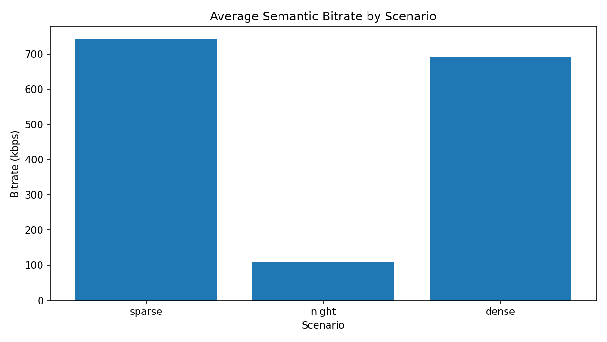

The night stress clip uses much lower bitrate because the ROI area is small and the controller aggressively limits semantic payload. Dense traffic uses higher bitrate because it preserves more vehicle ROI evidence.

### FPS

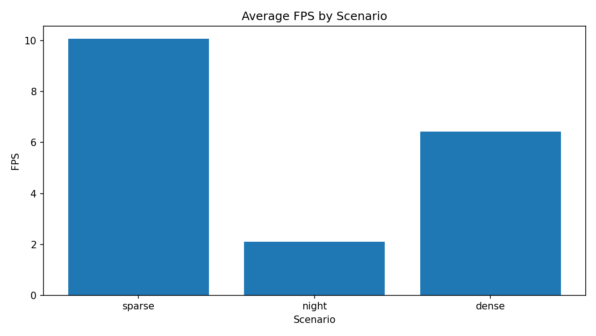

Sparse/object-light traffic reaches the highest FPS. Dense traffic remains usable on the Uno Q while preserving task quality. Night is slower because detector and validation cost increase significantly.

### Average latency

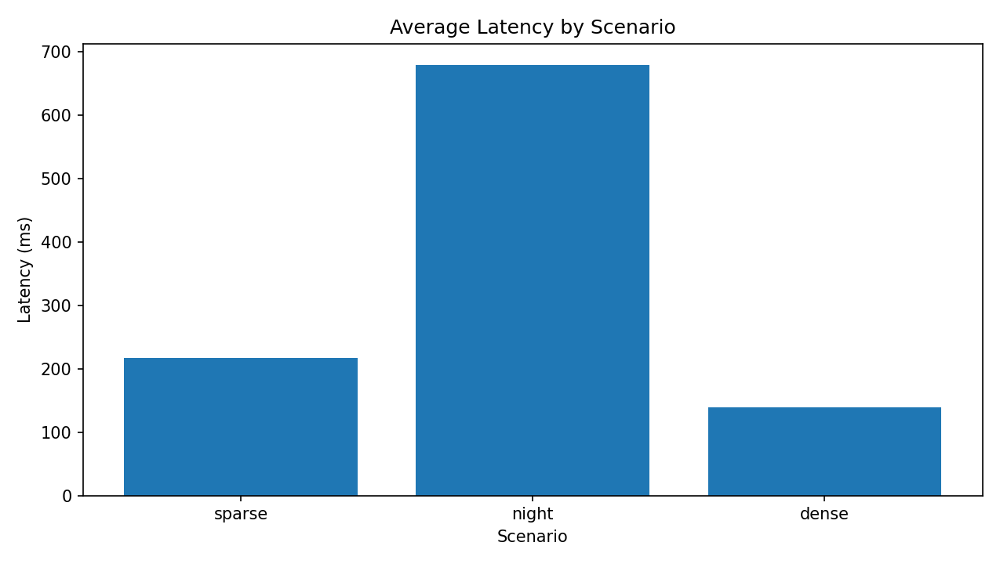

Dense traffic achieves the best average latency despite having the highest ROI area ratio. This is the key adaptive-controller result.

### P95 latency

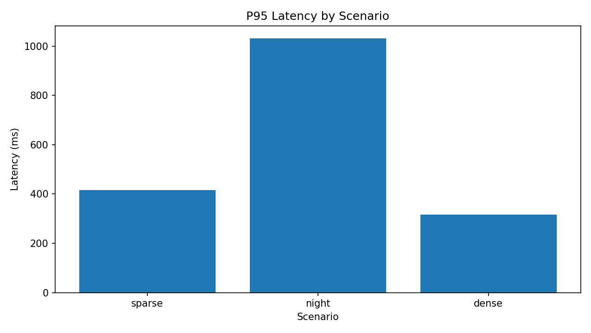

P95 latency shows the worst-case tail behavior. The short night stress clip has the largest latency tail because detector execution dominates.

### Task preservation loss

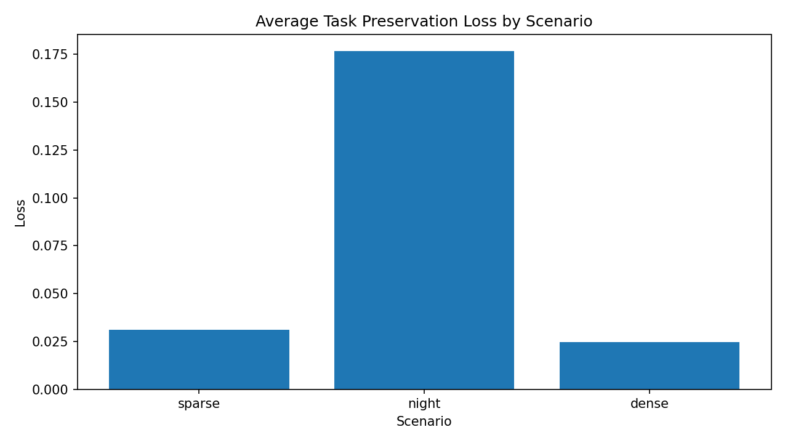

Lower is better. Dense traffic achieves the lowest task preservation loss, showing that the semantic compression preserved vehicle evidence well.

### Semantic PSNR

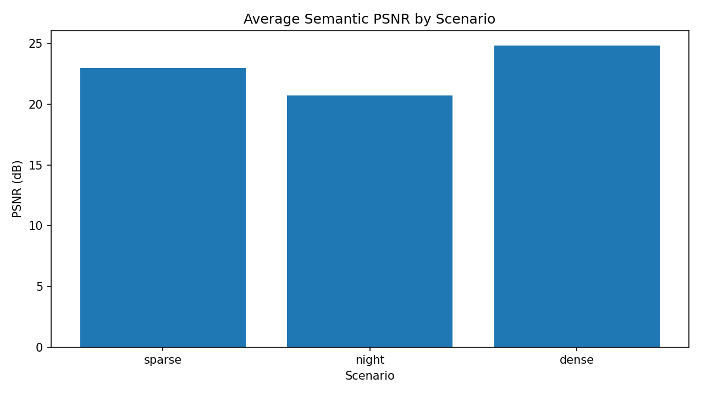

Dense traffic achieves the highest PSNR among the three final scenarios.

### Semantic SSIM

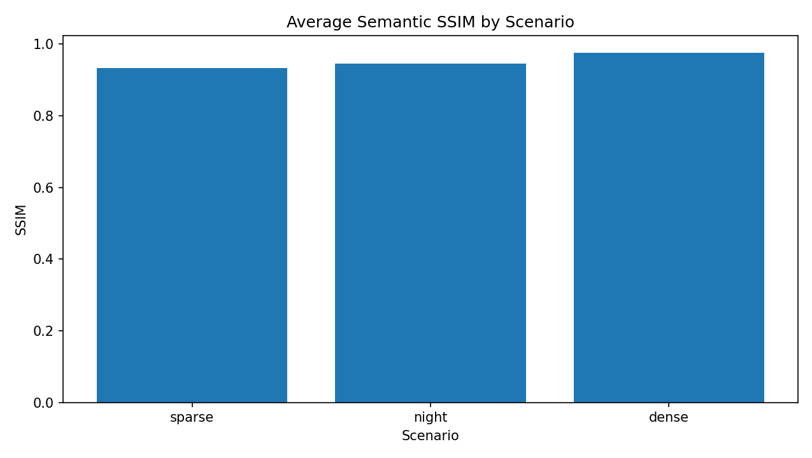

Dense traffic reaches the strongest structural similarity score.

### ROI area ratio

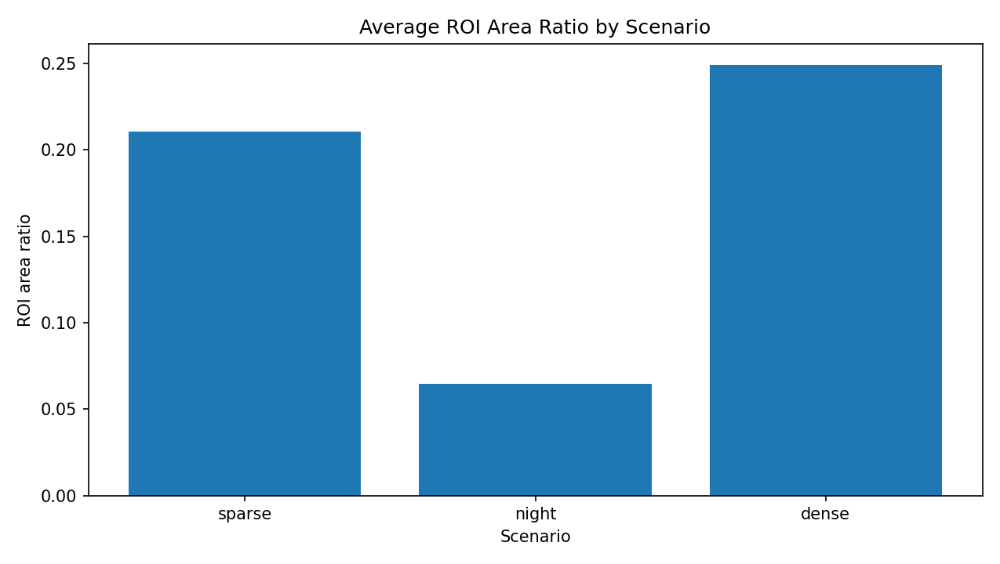

Dense traffic has the highest ROI area ratio, which confirms that it is the strongest test for the ROI-aware semantic controller.

### ISP input brightness

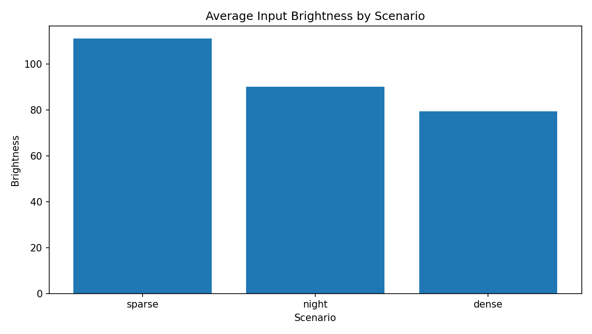

This shows the incoming brightness level before ISP tuning.

### ISP output brightness

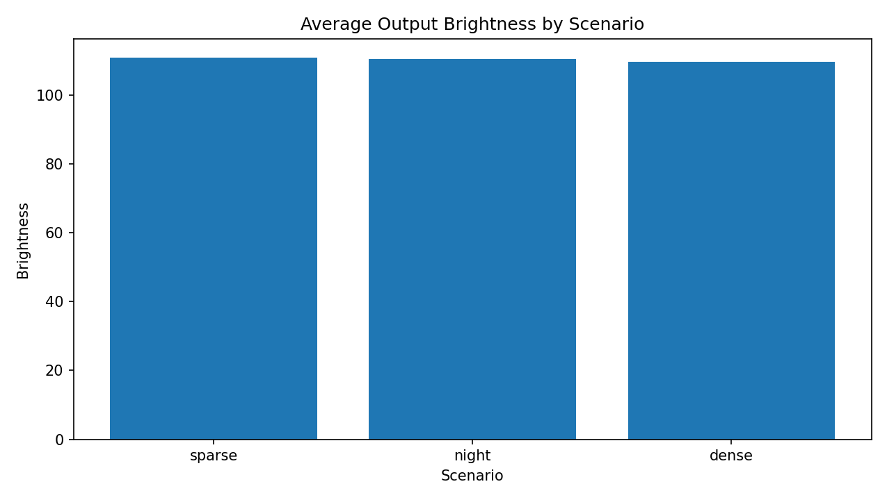

Output brightness is normalized across scenarios after ISP-lite enhancement.

### ISP input contrast

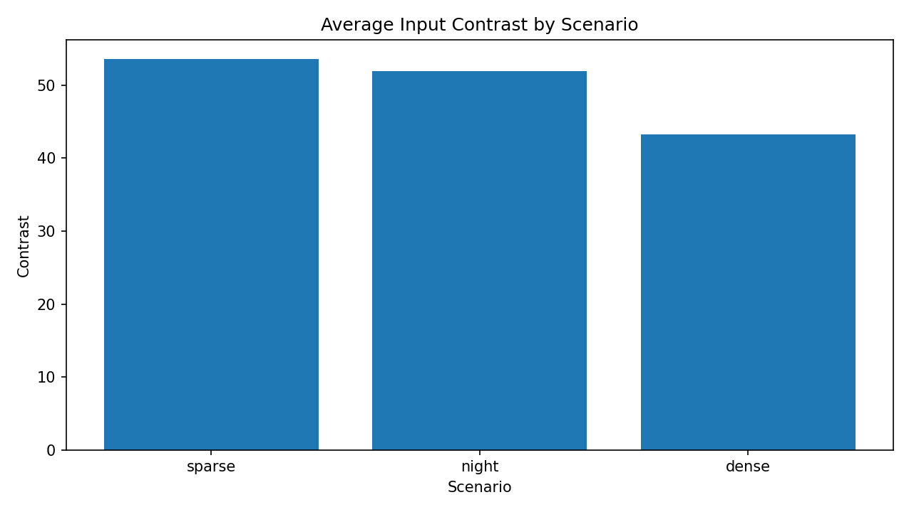

Dense and night scenes have lower input contrast than the sparse/object-light clip.

### ISP output contrast

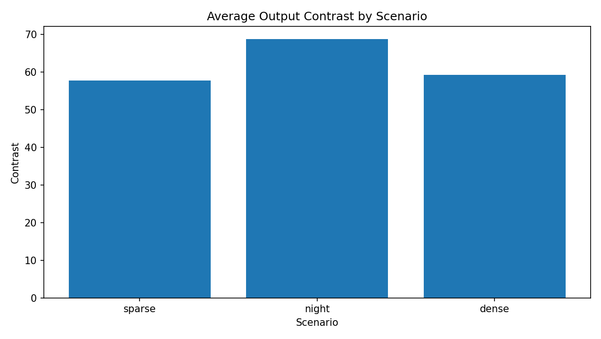

ISP-lite improves contrast before ROI detection and semantic encoding.

### ISP runtime

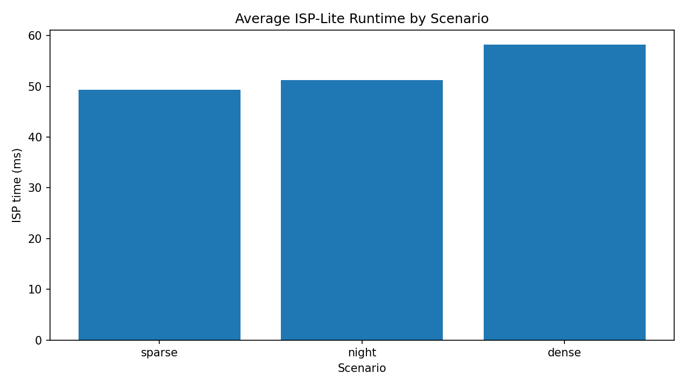

ISP-lite runs in roughly 49-58 ms on average across the final scenarios.

---

## Project structure

```text
vcm-lite-edge-camera/
├── assets/
│   └── videos/
│       └── demo/
│           ├── detrac_sparse_1_2_cars.mp4
│           ├── videoplayback.mp4
│           └── 457701_Asia_Korea_3840x2160.mp4
├── benchmarks/
│   ├── analyze_metrics.py
│   ├── plot_metrics.py
│   ├── run_analysis.py
│   ├── final_runs/
│   │   ├── sparse/
│   │   ├── night/
│   │   └── dense/
│   └── final_results/
├── control_plane/
│   ├── main.py
│   └── dashboard.py
├── cpp_engine/
│   ├── include/
│   ├── src/
│   └── CMakeLists.txt
├── deployment/
│   ├── run_all_unoq.sh
│   ├── stop_all_unoq.sh
│   └── status_unoq.sh
├── docs/
│   └── images/
│       ├── dense_1.png
│       ├── night_1.png
│       ├── night_2.png
│       ├── night_3.png
│       └── night_short_1.png
├── models/
│   ├── object_detector.onnx
│   └── labels.txt
├── sensor_sender/
│   ├── dataset_sender.py
│   └── http_signaling.py
└── README.md
```

---

## How to run

### 1. Start services on the Uno Q

SSH into the Uno Q and run:

```bash
cd ~/Projects/vcm-lite-edge-camera

./deployment/stop_all_unoq.sh
rm -f logs/*.jsonl
rm -f outputs/latest_*
rm -f outputs/detection_history.jsonl
rm -f outputs/validation_history.jsonl
rm -f logs/runtime/*.log

./deployment/run_all_unoq.sh
./deployment/status_unoq.sh
```

This starts:

```text
WebRTC signaling server
WebRTC receiver
C++ semantic engine
FastAPI dashboard
MCU telemetry loop
```

---

### 2. Run the video sender

Activate the sender environment:

```powershell
cd sensor_sender
.\.venv\Scripts\activate
```

Run sparse/object-light video:

```powershell
python dataset_sender.py --video "../assets/videos/demo/detrac_sparse_1_2_cars.mp4" --signaling-url "http://<uno-q-ip>:9000" --resize-width 640 --max-fps 15 --reset
```

Run night stress video:

```powershell
python dataset_sender.py --video "../assets/videos/demo/videoplayback.mp4" --signaling-url "http://<uno-q-ip>:9000" --resize-width 640 --max-fps 15 --reset
```

Run dense traffic video:

```powershell
python dataset_sender.py --video "../assets/videos/demo/457701_Asia_Korea_3840x2160.mp4" --signaling-url "http://<uno-q-ip>:9000" --resize-width 640 --max-fps 15 --reset
```

---

### 3. Open dashboard

```text
http://<uno-q-ip>:8000/dashboard
```

---

### 4. Copy logs after each run

Example for dense run:

```powershell
cd <repo-root>

scp arduino@<uno-q-ip>:~/Projects/vcm-lite-edge-camera/logs/metrics.jsonl benchmarks/final_runs/dense/metrics.jsonl
scp arduino@<uno-q-ip>:~/Projects/vcm-lite-edge-camera/logs/metadata.jsonl benchmarks/final_runs/dense/metadata.jsonl
scp arduino@<uno-q-ip>:~/Projects/vcm-lite-edge-camera/logs/webrtc_receiver.jsonl benchmarks/final_runs/dense/webrtc_receiver.jsonl
scp arduino@<uno-q-ip>:~/Projects/vcm-lite-edge-camera/outputs/detection_history.jsonl benchmarks/final_runs/dense/detection_history.jsonl
scp arduino@<uno-q-ip>:~/Projects/vcm-lite-edge-camera/outputs/validation_history.jsonl benchmarks/final_runs/dense/validation_history.jsonl
```

Repeat for:

```text
benchmarks/final_runs/sparse/
benchmarks/final_runs/night/
benchmarks/final_runs/dense/
```

---

### 5. Generate final plots

```powershell
cd <repo-root>

python benchmarks\run_analysis.py --all-final --output benchmarks\final_results
```

This generates:

```text
benchmarks/final_results/final_comparison.csv
benchmarks/final_results/comparison_latency_ms.png
benchmarks/final_results/comparison_p95_latency_ms.png
benchmarks/final_results/comparison_bitrate_kbps.png
benchmarks/final_results/comparison_task_preservation_loss.png
benchmarks/final_results/comparison_semantic_psnr_db.png
benchmarks/final_results/comparison_semantic_ssim.png
benchmarks/final_results/comparison_roi_area_ratio.png
benchmarks/final_results/comparison_fps.png
benchmarks/final_results/comparison_input_brightness.png
benchmarks/final_results/comparison_output_brightness.png
benchmarks/final_results/comparison_input_contrast.png
benchmarks/final_results/comparison_output_contrast.png
benchmarks/final_results/comparison_isp_ms.png
```

---

## Current strengths

VCM-Lite demonstrates several important engineering strengths:

```text
real-time-style WebRTC video ingest
edge deployment on Arduino Uno Q
C++ video-processing engine
fine-tuned ONNX vehicle detector
ISP-lite image enhancement
semantic context + ROI compression
task-aware reconstruction validation
closed-loop adaptive controller for ROI, bitrate, latency, and task-loss pressure
FastAPI dashboard observability
MCU telemetry integration
final benchmark pipeline with plots and CSV summaries
```

The strongest final result is the dense traffic case, where VCM-Lite preserves task evidence while keeping latency and bitrate controlled on the edge device.

---

## Limitations

The current project is a prototype, not a production camera product.

Current limitations:

```text
video source is a repeatable MP4 sender, not a physical camera module
night clip is short, so average metrics are affected by startup and validation cost
semantic codec is JPEG-based, not a full MPEG-VCM or H.26x codec
detector is scheduled and reused, not run on every frame
evaluation uses three representative clips, not a large benchmark suite
MCU telemetry is a compact health/status demonstration, not a full safety controller
```

These limitations are intentional for a practical edge prototype. The project focuses on demonstrating the full system idea end-to-end.

---

## Future work

Practical next steps:

```text
connect a physical camera source instead of MP4 sender
add hardware H.264/H.265 context encoding
evaluate on a larger traffic-video benchmark
add object-level mAP comparison before and after semantic reconstruction
add multi-camera stream support
add better low-light detector adaptation
support dynamic WebRTC bitrate feedback
port selected modules to more optimized C++/NEON paths
use MCU telemetry for watchdog and hardware status signaling
```

---

## Main takeaway

VCM-Lite shows how a traffic edge camera can move from frame-centric compression to task-aware semantic compression.

Instead of treating all pixels equally, it preserves object evidence, adapts to traffic density, validates machine-task quality, and exposes the full pipeline through live metrics and dashboard visualization.

The main system-level contribution is the adaptive controller. Instead of using a fixed compression policy, VCM-Lite continuously responds to scene density and runtime pressure. In sparse/object-light scenes it can reduce semantic effort, in dense traffic it prioritizes vehicle ROIs, and in night stress conditions it falls back to protection behavior when detector cost increases.

The headline dense-traffic result is:

```text
average latency          : 138.92 ms
P95 latency              : 316.09 ms
semantic bitrate         : 693.89 kbps
task preservation loss   : 0.0247
semantic PSNR            : 24.82 dB
semantic SSIM            : 0.9748
```

This demonstrates a practical edge implementation of VCM-inspired semantic video compression with real-time-style ingest, adaptive control, and task-preservation measurement on Arduino Uno Q.
